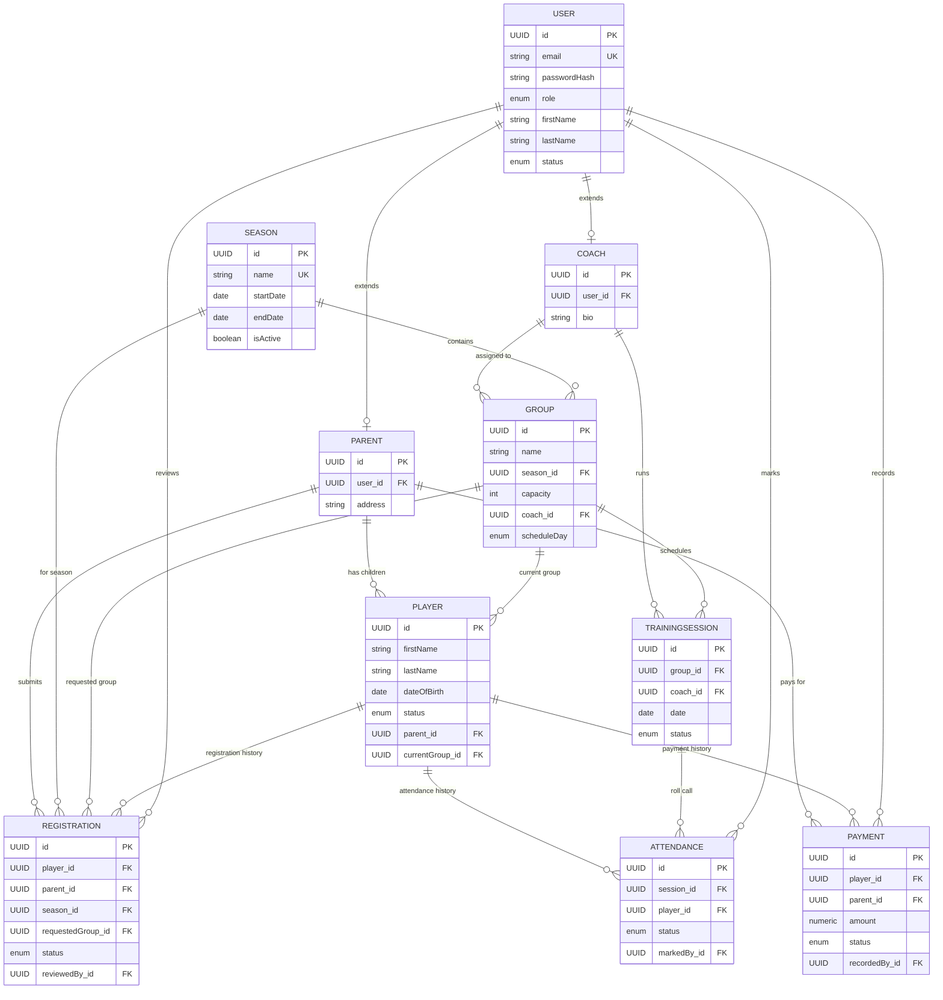

# Entity Relationship Diagram — MVP

Field-level definitions live in `entities.md`. This is the relationship map.

## Key constraints

- `registration(player_id, season_id)` — unique. One registration row per player per season → historical trail (§10).
- `attendance(session_id, player_id)` — unique. One attendance mark per player per session.
- `payment(player_id, period)` — unique. One payment record per player per billing period.
- `season.isActive` — only one row true at a time, enforced in `SeasonService`, not a DB constraint (simpler for v1, revisit if it becomes a real bug source).
- `player.currentGroup_id` is set/cleared by the registration approval workflow — never edited directly by an admin CRUD form, to keep it consistent with registration history.

## Cascade / delete rules

Nothing in this schema is hard-deleted from the app (§7: players are archived, not deleted; §26 wants audit history preserved). FK deletes should be `RESTRICT` by default; only `Attendance`/`Registration`/`Payment` rows may cascade if their parent `TrainingSession`/`Player` is removed by an admin — and in practice the app never exposes a hard delete for `Player`, `Group`, or `Season` in the MVP, only archive/deactivate flags.
